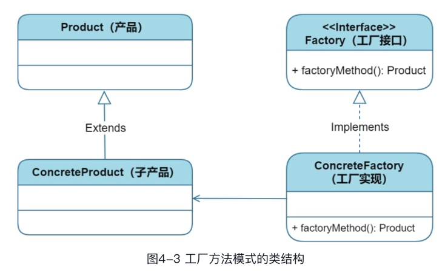
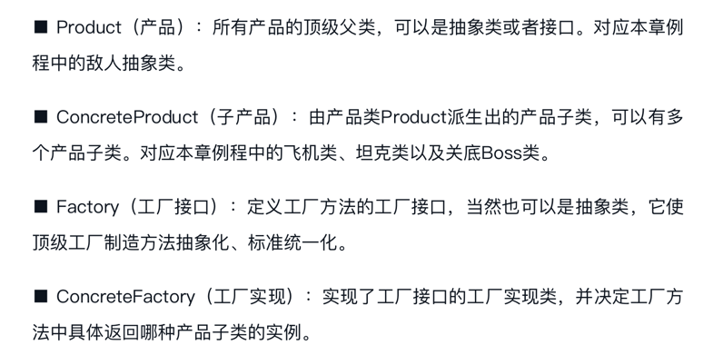

## 工厂模式

1、什么是工厂模式
- 工厂模式（Factory Pattern）是一种创建型设计模式，它提供了一种创建对象的最佳方式，而无需暴露对象的创建逻辑。
- 工厂模式通过将对象的创建委托给一个专门的工厂类来实现，该工厂类根据特定的要求（如不同的参数、条件等）生成相应的对象。
- 这样，客户端就可以创建一个对象，而不必知道具体的对象类型、构造函数或创建过程。工厂模式可以提高代码的可维护性、灵活性和可扩展性。
- 常见的工厂模式包括简单工厂模式、工厂方法模式和抽象工厂模式。

2、工厂模式分类
- 简单工厂模式：简单工厂模式是一个静态工厂方法，它接收不同的参数，根据参数的不同返回不同类的实例，具体的实现是在静态方法中通过 if/else 或 switch/case 语句进行判断，并返回相应的实例。
- 工厂方法模式：工厂方法模式是定义一个工厂接口，由子类来实现工厂接口中定义的方法，并且利用这些工厂方法创建具体对象，工厂方法可以解决简单工厂模式的缺点，它不需要使用大量的 if/else 或 switch/case 语句来判断不同的产品类型，而是将具体产品的生产延迟到子类中。
- 抽象工厂模式：抽象工厂模式是定义一个抽象接口，在工厂接口中声明创建一组相关对象的抽象方法，并由其子类实现，抽象工厂模式可以看作是工厂方法模式的进一步扩展，它将一个工厂方法所能创建的全部产品族集合到一起，如一个汽车工厂可以生产轿车、货车和客车等不同系列的汽车。

3、抽象工厂模式的好处
- 能够实现客户端代码与具体工厂实现解耦，同时保证所创建的对象是互相匹配并且在同一工厂创建的。

