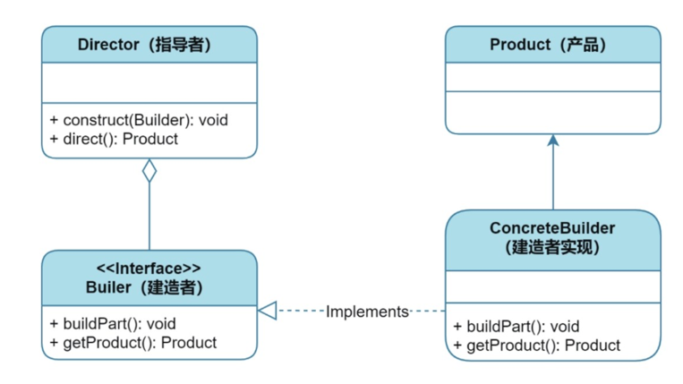
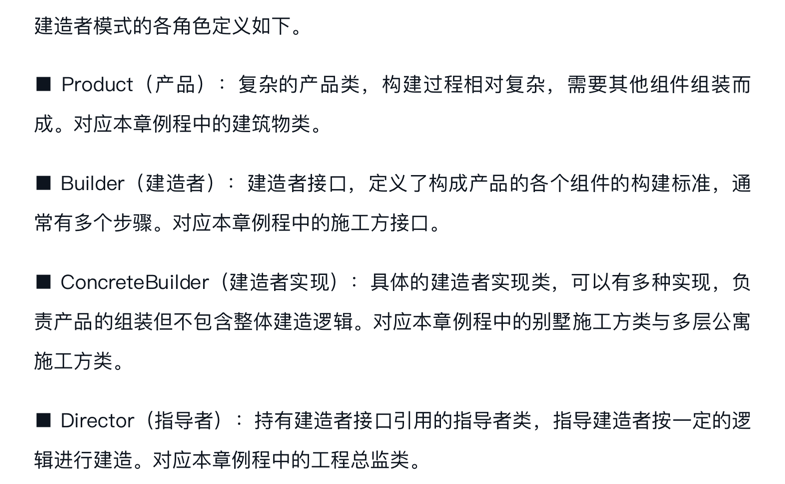

## 建造者模式
### 如何应对复杂对象的创建
- 建造者模式就是将一个复杂对象的创建过程分解为若干个简单的部分，通过一个指挥者来逐步构建这个复杂对象，最终返回一个完整的对象。
- 它的好处是可以简化对象的创建过程，并且可以根据需要来定制不同的对象表示形式。
### 如何优化建造者模式
- **使用流式接口**：将建造者模式的构建过程改为使用流式接口来构建对象，可以使代码更加简洁易读，也可以避免创建出不完整或者不合法的对象。例如，在Java中，可以使用Lombok库中的@Builder注解或者使用Java8的lambda表达式来实现流式接口。
- **使用函数式编程**：使用函数式编程可以避免创建大量的builder类和director类，同时也可以使代码更加简洁和易于扩展。例如，在Scala中，可以使用Case Class和apply方法来构建对象。
- **使用静态工厂方法**：使用静态工厂方法可以使代码更加简洁易用，同时也可以避免创建大量的builder类和director类。例如，在Java中，可以使用static方法来直接构建对象。
- **使用原型模式**：使用原型模式可以避免进行大量的对象复制和创建，同时也可以提高对象的复用率。例如，在Java中，可以使用clone方法或者使用第三方库来实现快速的对象复制。
- 简洁的要义是避免创建大量的builder和director类，避免创建大量对象
### 与工厂模式和抽象工厂模式的比较
- 建造者模式：主要用于创建复杂对象，并且可以实现对象构建的流程控制。
- 工厂模式：主要用于创建对象，但是可以通过不同的工厂类来创建不同的对象类型。
- 抽象工厂模式：主要用于创建一系列相关的对象，例如创建一个按钮工厂和一个文本框工厂。
#### 下面对比三者的优缺点：
- 建造者模式
  - **优点**是可以创建复杂对象，并且可以实现对象构建的流程控制。
  - **缺点**是需要编写大量的代码，如果对象变动频繁，需要维护大量的builder类和director类。
- 工厂模式
  - **优点**是可以通过不同的工厂类来创建不同的对象类型，使得代码更加灵活。
  - **缺点**是无法创建复杂对象，如果要创建复杂对象需要使用建造者模式。
- 抽象工厂模式
  - **优点**是可以创建一系列相关的对象，例如创建一个按钮工厂和一个文本框工厂。
  - **缺点**是扩展性不如工厂模式，在新加一个产品族的时候需要修改代码。

### 建造者模式UML

